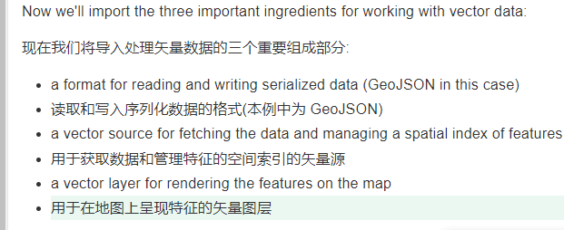
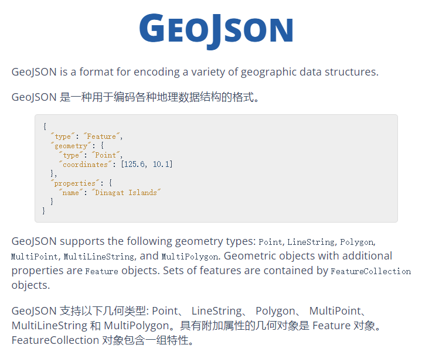

# OpenLayers + Vite

This example demonstrates how the `ol` package can be used with [Vite](https://vitejs.dev/).

To get started, run the following (requires Node 14+):

    npx create-ol-app my-app --template vite

Then change into your new `my-app` directory and start a development server (available at http://localhost:5173):

    cd my-app
    npm start

To generate a build ready for production:

    npm run build

Then deploy the contents of the `dist` directory to your server.  You can also run `npm run serve` to serve the results of the `dist` directory for preview.

## app结构
- 主要由三部分组成
  - index.html
  - main.js 
    - 这是应用模块的入口点，带有osm源
  - style.css

## 创建教程
-[创建教程](https://blog.csdn.net/weixin_42078172/article/details/123826626)

## 基本的概念
- Map
  - ol的核心组件是Map，被呈现到一个目标容器中，div元素中，所有的 map 属性可以在构造时配置，也可以使用 setter 方法，例如 setTarget ()。
- View
- Source
- Layer
  - OpenLayers has four basic types of layers:(有四种类型的层)
  - ol/layer/Tile
  - ol/layer/Image
  - ol/layer/Vector 客户端呈现矢量数据。
  - ol/layer/VectorTile 呈现作为矢量图块提供的数据。

# 关键知识：
- 如果没有指定(如上面的代码片段) ，默认的投影是 SpherealMercator (EPSG: 3857) ，以米作为映射单位。
layer：层
contorl：控件
feature：元素
interaction：交互
Vector：矢量的
Tile：瓦片
source：资源
format：转换
projection：投影

# 如何使用vector data
- Rendering GeoJSON  展示geojson数据分成三个组成部分

 - 读入数据
 - 用于获取数据和管理特征的空间索引的矢量源
 - a vector layer for rendering the features on the map

## geojson数据

## 